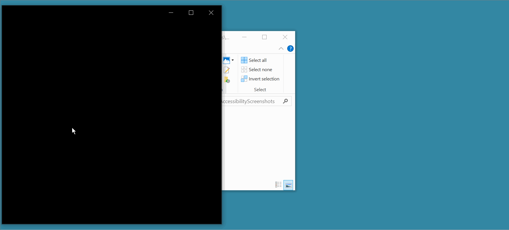

# photo-viewer

hack project photo viewer with support for showing accessibility trees embedded by https://github.com/karanbirsingh/accessible-screenshots

You can try this with [test.png](test.png)
